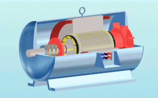
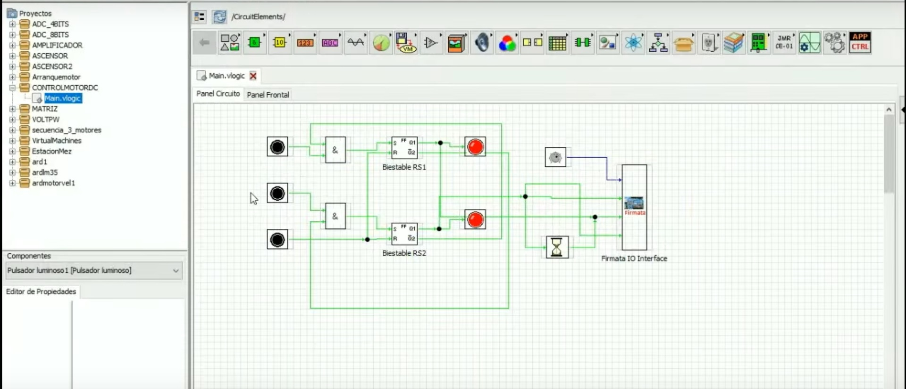

# Actuadores Electricos.
Los actuadores son dispositivos que llevan incorporado un motor eléctrico y un reductor que permite accionar cualquier dispositivo para llevar a cabo determinado movimiento u acción. Por ejemplo, se emplean en la industria para accionar compuertas, válculas y en general diferentes elementos que ponen en comunicación un proceso con otro o un estado de un proceso con otro.

El actuador eléctrico es el que almacena los datos de válculas y carrera y posteriormente dicha información es procesada por la parte de control que es precisamente la que se encarga de conectarlo y desconectarlo según las necesidades.

Así pues, un actuador en general es un dispositivo que puede transformar un tipo de energía en un proceso que se activa a raíz de ella. De ahí precisamente viene su nombre. Su objetivo es conseguir dicho efecto sobre el proceso de automatizado. El controlador recibe la orden del actuador y a partir de ella genera una respuesta para activar un elemento final como podría ser una compuerta.

Podemos decir que en el caso específico de los actuadores eléctricos la fuente que inicia dicho proceso es una fuente eléctrica. Por ello es por lo que precisamente su estructura suele ser más simple que la de los actuadores neumáticos o hidráulicos.

| Actuador    	| Definicion                                                                                                                                                                                                                                                                                                                       	| Funcionamiento                                                                                                                                                                                                                                                                                                	| Características                                                                                                                                                                                                                      	|
|-------------	|----------------------------------------------------------------------------------------------------------------------------------------------------------------------------------------------------------------------------------------------------------------------------------------------------------------------------------	|---------------------------------------------------------------------------------------------------------------------------------------------------------------------------------------------------------------------------------------------------------------------------------------------------------------	|--------------------------------------------------------------------------------------------------------------------------------------------------------------------------------------------------------------------------------------	|
| Eléctricos  	| Los actuadores electrónicos también son muy utilizados en los aparatos mecatrónicos, como por ejemplo, en los robots de tamaño mediano, pues éstos no requieren de tanta velocidad ni potencia como los robots diseñados para funcionar con actuadores hidráulicos.                                                              	| Como se utilizan cables eléctricos para transmitir electricidad y las señales, es altamente versátil y prácticamente no hay restricciones respecto a la distancia entra la fuente de poder y el actuador.                                                                                                     	| Las características de control, sencillez y precisión de los accionamientos eléctricos han hecho que sean los más usados en los robots industriales actuales, como por ejemplo el uso de un robot en fabrica de autos en el pintado. 	|
| Mecánicos   	| Los Actuadores Mecánicos son dispositivos que utilizan energía mecánica para su funcionamiento. En función de la fuente de energía utilizada pueden ser neumáticos o hidráulicos, es decir, los actuadores mecánicos son dispositivos que transforman el movimiento rotativo a la entrada, en un movimiento lineal en la salida. 	| La misión de los actuadores es generar o transmitir movimiento a piezas o elementos, previas órdenes dadas por la unidad de control y mando. Los actuadores hidráulicos utilizan como energía aceites minerales, que trabajan a presión entre 50 y 100 bares y que en ocasiones pueden superar los 300 bares. 	| Las bombas hidráulicas son los elementos encargados de impulsar el aceite o líquido hidráulico, transformando la energía mecánica rotatoria en energía hidráulica.                                                                   	|
| Hidráulicos 	| Los actuadores hidráulicos se utilizan para maquinarias grandes, las cuales presentan mayor velocidad y mayor resistencia mecánica. Se clasifican de acuerdo con la forma de operación, funcionan en base afluidos a presión.                                                                                                      	| Su tamaño va en función de las cargas operacionales que tenga que sufrir y básicamente consiste en un cilindro exterior dentro del cual se desliza un pistón. Unido al pistón se encuentra un vástago que atraviesa el fondo del cilindro y es el que transmite el movimiento linealmente.                    	| Son componentes que transforman la energía hidráulica, que reciben en mecánicaTienen como función convertir el flujo de fluido hidráulico en movimiento lineal o rotatorio.                                                          	|

## Tipos de actuadores eléctricos.

A continuación te detallamos los tipos de actuadores eléctricos que existen así como sus principales funciones.

- Motores de corriente continua (DC):

Estos motores son los que más se emplean en la actualidad sobre todo gracias a su gran versatilidad y la facilidad de control que ofrecen. En el motor se incorpora un sensor para la posición que es el que realiza el control sobre la acción del actuador eléctrico.

- Controlados por excitación:

Se crea un campo magnético de dirección fija.

- Controlados por inducción:

El inducido se sitúa en el estator.

- Motores de corriente alterna (AC):

En ellos podemos distinguir dos tipos:

    - Síncronos.
    - Asíncronos.

- Motores de paso a paso:

A su vez, estos pueden ser de tres tipos:

    - De imanes permanentes.
    - De reluctancia variables.
    - Híbridos.

## Funciones de los actuadores :computer:
Como hemos dicho, un actuador eléctrico está involucrado en numerosos procesos industriales. Aquí te detallamos algunas de sus funciones:

- Sistemas de visión y corrección remota de posiciones.
- Movimiento de brazos articulados para líneas de producción automatizadas.
- Encolado y fresado.
- Manipulación automática de objetos, por ejemplo en laboratorios, con gran precisión y rapidez en sistemas de pick and place.
- Elevadores verticales.
- Desplazamiento de cargas a gran precisión y velocidad.

## Ejemplos de actuadores electricos.

| *Nombre*          | *Descripción*                                                                                                                                                                                                                                      | *Usos*                                                                                                     | *Precio estimado*                                              | *Datasheet*                                                              |
|-------------------|----------------------------------------------------------------------------------------------------------------------------------------------------------------------------------------------------------------------------------------------------|------------------------------------------------------------------------------------------------------------|----------------------------------------------------------------|--------------------------------------------------------------------------|
| Motor Paso a Paso | Dispositivo electromecánico que convierte una serie de pulsos eléctricos en desplazamientos angulares, lo que significa que es capaz de girar una cantidad de grados (paso o medio paso) dependiendo de sus entradas de control.                   | Mecanismos en donde se requieren movimientos muy precisos, como Cabezales para de discos duros, Impresoras | $ 200 Dlls.                                                    | https://www.micromo.com/media/pdfs/DM0620.pdf                            |
| Motor AC          | Motores eléctricos que funcionan con este tipo de alimentación eléctrica, convierte la energía eléctrica en fuerzas de giro por medio de la acción mutua de los campos magnéticos.                                                                 | Compresores, Ventiladores, Lavadoras                                                                       | Dependiendo el tamaño y la capacidad De entre $10 a $150 Dlls. | http://www.ee.ic.ac.uk/pcheung/teaching/DE1_EE/stores/sg90_datasheet.pdf |
| Motor DC          | Motor que convierte energía eléctrica en energía mecánica, mayor control sobre la velocidad, ya que puede ajustarse aplicando una resistencia variable en el inductor. Además, es posible cambiar el sentido de rotación invirtiendo la polaridad. | Máquinas extractoras, Cerraduras electronicas                                                              | $ 10 a $ 20 Dlls.                                              | https://www.micromo.com/media/pdfs/0615_S.pdf                            |

## Ventajas y Desventajas

| Tipo        | Ventajas                                                                     | Desventajas                                                |
|-------------|------------------------------------------------------------------------------|------------------------------------------------------------|
| Eléctrico   |  <ul><li>Precisos y fiables.</ul></li> <ul><li>Silenciosos.</ul></li>  <ul><li> Control Sencillo</ul></li>  <ul><li>Fácil Instalación</ul></li>  | <ul><li>Potencia limitada</ul></li>                                       |
| Mecánicos   |  <ul><li>Bajo Costo.</ul></li> <ul><li>Rapidos  <ul><li>Sencillos</ul></li> <ul><li>Robustos.</ul></li>                            |  <ul><li>Instalación especial.</ul></li>  <ul><li>Ruidosos</ul></li>                      |
| Hidráulicos |  <ul><li>Rapidos.</ul></li> <ul><li>Alta Capacidad de Carga.</ul></li>                                      |  <ul><li>Instalación especial.</ul></li> <ul><li>Dificil de mantener</ul></li> <ul><li>Muy Caros</ul></li> |

## Demo en MyOpenLab

## Fuentes 
[Actuadores](http://www.dis.uia.mx/taller_industrial/blog/wp-content/uploads/2013/10/ACTUADORES.pdf)

[Clasificación](https://www.micromo.com/)
